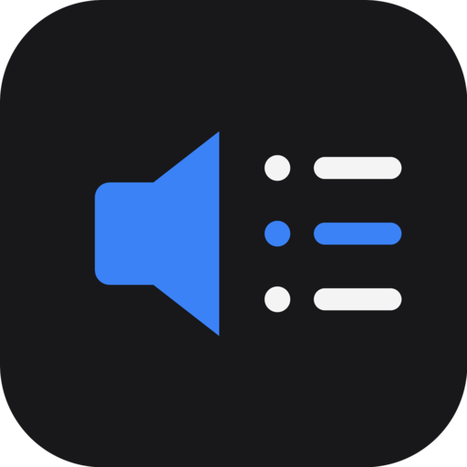

<p align="center">
  
</p>

<h1 align="center">Slip Sound</h1>

<p align="center">
  <strong>Fast, brain-dead simple desktop audio sample manager.</strong>
</p>

Most sample organizers are bloated nightmares or require cloud accounts and subscriptions just to search files on your own hard drive.

Slip Sound is fast, local, and free. No accounts, no subscriptions, and no file caps. Just your sounds.

## Core Philosophy

Every folder you open gets its own SQLite database, saved right at that folder's root. Index once, then just open it again later, instant. Reindex only when you've actually added or changed files. No central catalog, no hidden app-data blob, the index travels with the folder.

## Performance

- **170,000 files in ~2 minutes:** Recursive scan into local SQLite.
- **Sub-0.2s search:** Instant fuzzy filtering across hundreds of thousands of rows.
- **Near-instant playback:** Zero audio buffering lag.
- **100% offline:** No tracking, no web services.

## What It Does

- **Search & Auto-Categorize:** Filter by query, channels, duration, favorites, or category sidebar. Files get auto-tagged on index.
- **Manual Category Overrides:** Click a category to reassign or clear it. Sticks through reindexes.
- **Sortable Table:** Click any column header to sort.
- **Favorites:** Star sounds, filter to favorites only.
- **Waveform Preview:** Click-to-seek, auto-play toggle, drag to select and loop a region.
- **Region Export & Drag-Out:** Export just the selected region, or drag it straight into another app.
- **DAW Drag & Drop:** Drag one file or a whole multi-selection into Reaper, Ableton, FL Studio, Godot, Unity, etc.
- **Batch Exporter:** WAV (16/24/32-bit) or OGG Vorbis, any sample rate, auto-numbered or lettered output names.
- **Reveal in Folder:** Jump to any file in your system file manager.
- **Remembers Where You Left Off:** Reopens your last library automatically.
- **Keyboard-Driven:** Full mouse-free navigation.
- **MCP Server (opt-in):** Let AI tools like Claude Desktop or Cursor search, tag, and export your library. Off by default, toggle it in Settings. See [MCP Server](#mcp-server).

## Quick Start

Requires [Bun](https://bun.sh).

```bash
bun install
bun run dev
```

Point it at a sample folder (`Ctrl+O`). It indexes automatically and caches locally.

## Keybindings

| Key | Action |
| --- | --- |
| `Space` | Play / Pause |
| `↑` / `↓` | Previous / Next sound |
| `Home` / `End` | Jump to top / bottom |
| `Double Click` | Play immediately |
| `Ctrl` + `Click` | Add/remove a sound from the multi-selection |
| `Shift` + `Click` | Select every sound between the last click and this one |
| `Ctrl` + `F` | Focus search |
| `Ctrl` + `O` | Open folder |
| `Ctrl` + `B` | Toggle category sidebar |
| `Ctrl` + `E` | Export selection / region |
| `Alt` + `A` | Toggle auto-play |
| `?` | Interactive help guide |

## MCP Server

Slip Sound can run a local [Model Context Protocol](https://modelcontextprotocol.io) server so AI tools (Claude Desktop, Cursor, VS Code, etc.) can search, tag, and export your library directly. Off by default. Turn it on from **Settings** (gear icon, top right), where you can also copy the connection URL and bearer token.

Bound to `127.0.0.1` only, with a random bearer token minted per launch and Origin/Host validation to block browser-based DNS-rebinding probes. Connection details (URL + token, ready to paste into an `mcpServers` config block) are also written to `mcp-connection.json` in the app's user data folder while it's running.

**Tools exposed:**

| Tool | What it does |
| --- | --- |
| `search_sounds` | Filter by filename, category, subcategory, channels, duration, favorite status |
| `list_uncategorized_sounds` | Page through sounds still tagged "Uncategorized," for an agent to work through and tag |
| `get_sound` | Full metadata for one file by path |
| `get_categories` | Category/subcategory facet counts |
| `open_library` | Open or switch to a folder |
| `get_recent_libraries` | Recently opened folders |
| `get_library_status` | Currently open folder + sound count |
| `set_category` / `clear_category` | Manually tag or untag a sound |
| `toggle_favorite` | Star / unstar a sound |
| `export_sound` | Export (optionally trimmed) to WAV/OGG at any sample rate |
| `reveal_in_folder` | Open the file's location in the system file manager |
| `reindex_library` | Rescan the open folder for new/changed/removed files |

## Releases

Every GitHub release ships a `SHA256SUMS-linux.txt` / `SHA256SUMS-windows.txt` alongside the binaries. Verify a download with:

```bash
sha256sum -c SHA256SUMS-linux.txt   # Linux
certutil -hashfile slip-sound-Setup.exe SHA256   # Windows, compare against the .txt
```

CI only publishes when the pushed tag (`vX.Y.Z`) matches `package.json`'s `version` field exactly, mismatched or stale tags fail the build before packaging.

## Building

```bash
bun run build:linux  # AppImage, deb, tar.gz
bun run build:win    # NSIS installer, portable exe
bun run build:all    # Both
```

## Stack

Electron 39, Node 22 (`node:sqlite`), SolidJS, Tailwind CSS v4, electron-vite, ffmpeg-static, `@modelcontextprotocol/sdk`, Bun.

## Alternative To

A free, fast, local alternative to sample managers like Soundly, BaseHead, Soundminer, Resonic, AudioFinder, Sononym, and ADSR Sample Manager.